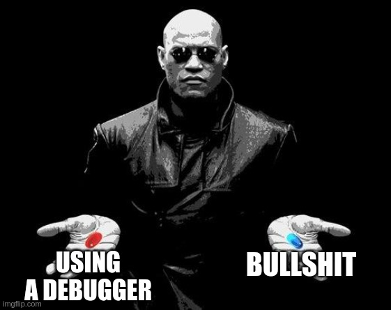
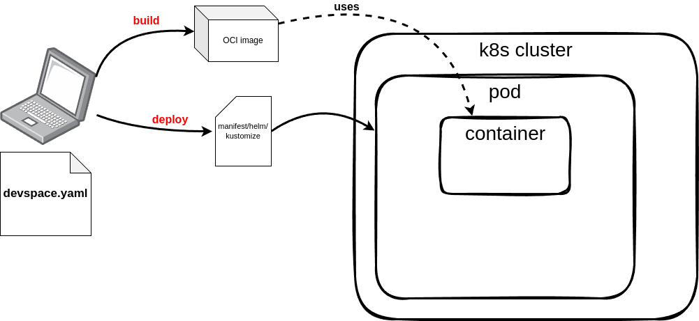
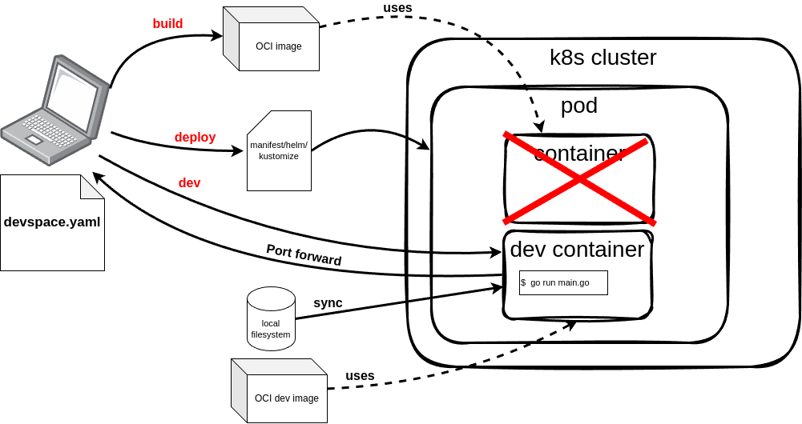

# K8s in-cluster debugging using devspace

What to expect?

- learn about devspace
- learn how devspace can help debugging
- live demo

---

# To clearify some terms

* What does the term "in-cluster debugging" mean?
* What is devspace?

---

## What does the term "in-cluster debugging" mean? 

In-cluster debugging refers to diagnosing and fixing issues within a Kubernetes cluster while the application is running in the development environment.

---

## What is devspace?

DevSpace is a client-only, open-source developer tool for Kubernetes:

- Build, test and debug applications directly inside Kubernetes
- Develop with hot reloading: updates your running containers without rebuilding images or restarting containers
- Unify deployment workflows within your team and across dev, staging and production
- Automate repetitive tasks for image building and deployment

Find it at [devspace.sh](https://devspace.sh/)

---

# How can devspace help in general?

---

# How can devspace help debugging?

---

# Live demo

- Spin up a local dev cluster
- Build and deploy the application
- Access the application
- Debug the application

